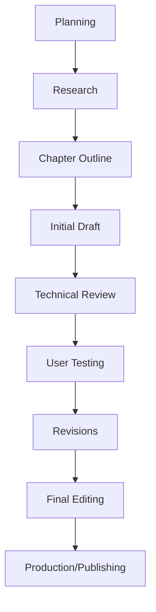
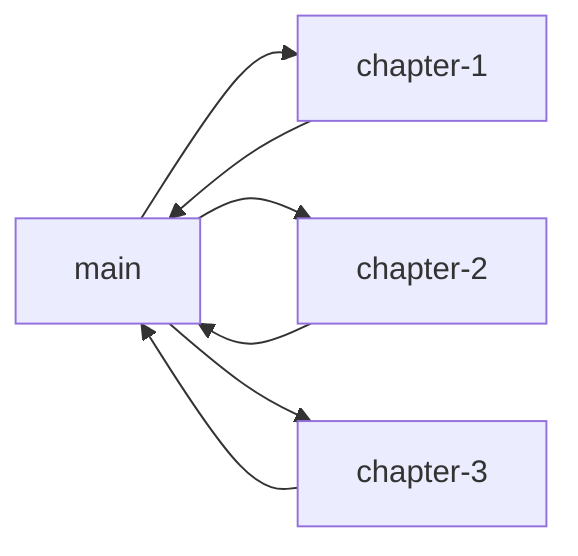
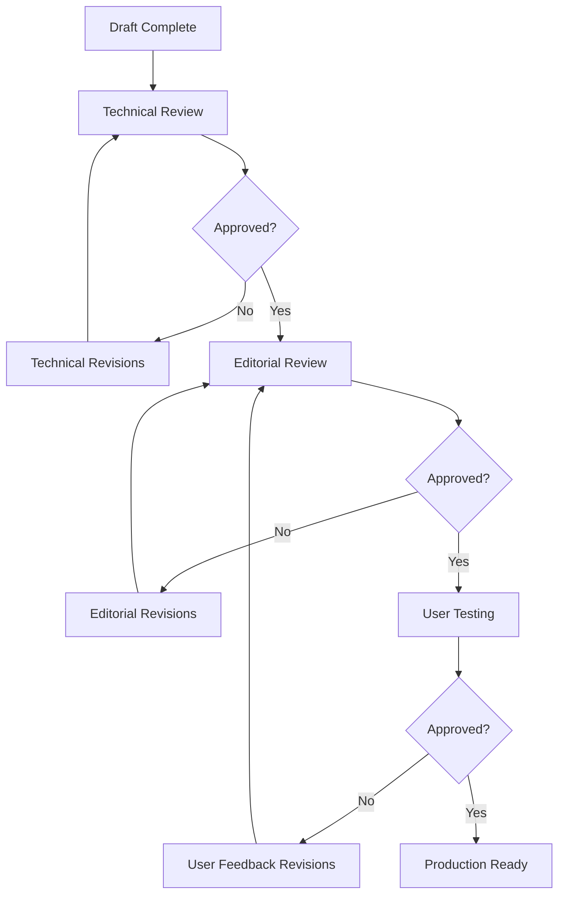

# Content Workflow Guide for "Tana for Real People"

This guide outlines the complete content workflow process for creating the "Tana for Real People" guide, using GitHub for content management and version control.

## Content Development Lifecycle

## Workflow Phases

### 1. Research Phase (Weeks 1-2)

**Activities:**
- Gather existing Tana documentation
- Interview non-technical Tana users
- Analyze competitor guides
- Identify common pain points and challenges

**Issue Types:**
- Use `research` label for all research tasks
- Create interview frameworks as issues
- Track documentation analysis progress

**Deliverables:**
- User interview summaries
- Documentation analysis report
- Key concept list with plain language alternatives
- Challenge assessment report

### 2. Planning Phase (Weeks 2-3)

**Activities:**
- Create detailed chapter outlines
- Develop content templates
- Design visual style guide
- Establish terminology guidelines

**Issue Types:**
- Use `planning` label for all planning tasks
- Create chapter outline issues
- Track template development

**Deliverables:**
- Complete book outline with chapter structure
- Content templates for consistent formatting
- Visual style guide for screenshots and diagrams
- Terminology glossary with plain language alternatives

### 3. Content Creation Phase (Weeks 3-10)

**Activities:**
- Draft all chapters
- Create screenshots and diagrams
- Develop exercises and examples
- Build templates for common scenarios

**Issue Types:**
- Use `writing` label for drafting tasks
- Use `visual` label for screenshot/diagram creation
- Track progress by chapter

**Deliverables:**
- Complete first draft of all chapters
- Visual assets for all key concepts
- "Try This" exercises for each major concept
- Ready-to-use templates

### 4. Review Phase (Weeks 10-12)

**Activities:**
- Technical accuracy review
- Editorial review for clarity and style
- Accessibility review
- Cross-reference verification

**Issue Types:**
- Use `review` label for all review tasks
- Create specific review issues for each chapter
- Track accessibility compliance

**Deliverables:**
- Technical review comments
- Editorial recommendations
- Accessibility compliance report
- Cross-reference validation report

### 5. User Testing Phase (Weeks 12-13)

**Activities:**
- Conduct user testing with target audience
- Collect feedback on clarity and usability
- Identify pain points and confusion areas
- Test exercises and templates

**Issue Types:**
- Use `review` label with `persona-` labels
- Create issues for each testing session
- Track user feedback by chapter

**Deliverables:**
- User testing results
- Feedback summary by chapter
- Recommended revisions list
- Template usability assessment

### 6. Revision Phase (Weeks 13-15)

**Activities:**
- Implement feedback from reviews and testing
- Clarify confusing sections
- Enhance visual elements
- Refine exercises and templates

**Issue Types:**
- Use `revision` label for all revision tasks
- Create specific issues for major revisions
- Track progress by chapter

**Deliverables:**
- Revised complete draft
- Updated visual elements
- Improved exercises and templates
- Revision summary report

### 7. Production Phase (Weeks 15-16)

**Activities:**
- Final proofreading
- Format validation
- Generate production files (HTML, PDF, EPUB)
- Final accessibility check

**Issue Types:**
- Use `final` label for production tasks
- Create format-specific issues
- Track final quality checks

**Deliverables:**
- Final production-ready files
- Distribution package
- Accessibility compliance certificate
- Publication checklist completion

## GitHub Workflow Integration

### Project Boards

Set up the following project board columns:
1. **Backlog**: All planned issues not yet started
2. **Research**: Current research tasks
3. **Planning**: Current planning activities
4. **Writing**: Content currently being drafted
5. **Visual Creation**: Screenshots/diagrams in progress
6. **Review**: Content under review
7. **Testing**: Content in user testing
8. **Revision**: Content being revised
9. **Final**: Production-ready content
10. **Done**: Completed items

### Issue Templates Usage

1. **For new chapters**:
   - Use chapter template
   - Apply appropriate milestone
   - Apply relevant persona tags

2. **For visual assets**:
   - Use visual asset template
   - Link to related chapter
   - Include specific requirements

3. **For review requests**:
   - Use review template
   - Link to content being reviewed
   - Set clear completion date

### Branch Management

- **Branch naming convention**: `chapter-X-name`
- Create branches for each chapter
- Make chapter-specific changes in chapter branches
- Merge to main when chapters complete technical review

### Milestone Tracking

Align milestones with project phases:
- **Research Phase**: All research and planning tasks
- **Content Creation**: All drafting and visual creation
- **Review & Testing**: All reviews and user testing
- **Production**: Final revisions and production tasks

### Regular Process

1. **Weekly content planning meeting**:
   - Review completed issues
   - Plan next week's content priorities
   - Address any blockers

2. **Daily check-in**:
   - Update issue status
   - Report progress on current tasks
   - Identify help needed

3. **Review process**:
   - Technical reviewer assigned to each chapter
   - Editorial reviewer assigned to each chapter
   - User testing feedback incorporated

## Approval Workflow

## Using CLI Commands

Reference the [GitHub Issue Commands](github-issue-commands.md) document for specific CLI commands to:
- Create and manage issues
- Set up milestones
- Add issues to specific milestones
- Create and manage project views 